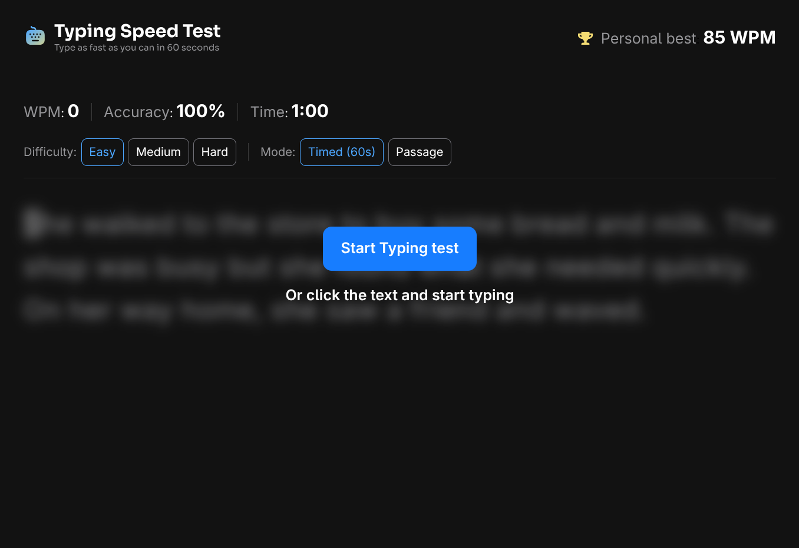

# Frontend Mentor - Typing Speed Test solution

This is a solution to the [Typing Speed Test challenge on Frontend Mentor](https://www.frontendmentor.io/challenges/typing-speed-test). Frontend Mentor challenges help you improve your coding skills by building realistic projects. 

## Table of contents

- [The challenge](#the-challenge)
- [Screenshot](#screenshot)
- [Built with](#built-with)
- [Links](#links)

## Screenshot

## The challenge
Users should be able to:

- View the optimal layout for the interface depending on their device's screen size
- See hover and focus states for all interactive elements on the page
- See their WPM and accuracy update in real-time
- Complete the test and see their results displayed
- Select difficulty level before starting the test
- Select the mode (timed or passage)
- Restart the test to start over
- See if his typing is correct or not in real time

## Built with
- [React](https://reactjs.org/)
- [Tailwind CSS](https://tailwindcss.com/)
- [canvas-confetti](https://www.npmjs.com/package/canvas-confetti)
- [Radix Primitives](https://www.radix-ui.com/primitives)

## Links

- Solution URL: [Add solution URL here](https://your-solution-url.com)
- Live Site URL: [Add live site URL here](https://your-live-site-url.com)

## Continued development
Currently the app has two issues:
- The current character is highlighted with a background color. However, zero-width characters (such as trailing spaces used for line wrapping) are not rendered, causing the highlight to disappear and potentially confusing the user.
- User input is captured via a hidden input element that receives focus when the test starts. This results in a poor user experience because the browser automatically scrolls to the hidden input as the user types.
